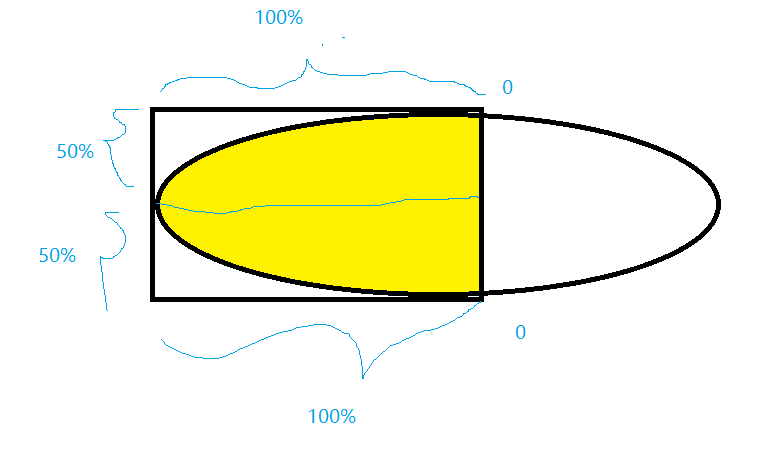
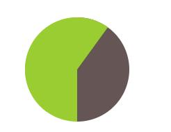
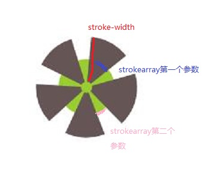

<style>
  .example {
    margin: 20px;
  }
  .css-ellipse {
    width: 200px;
    height: 100px;
    background: #fb3;
  }
  .css-ellipse1 {
    border-radius: 50%;
  }
  .css-ellipse2 {
    border-radius: 100% 0 0 100%/50%;
  }
  .css-ellipse3 {
    border-radius: 100% 0 0 0;
  }
  .parallelogram1 {
    width: 100px;
    height: 20px;
    background: yellowgreen;
    transform: skewX(-45deg);
    text-align: center;
  }
  .parallelogram2 {
    width: 100px;
    height: 20px;
    position: relative;
    text-align: center;
    z-index: 10;
  }
  .parallelogram2::before {
    content: '';
    width: 100%;
    height: 100%;
    background: yellowgreen;
    position: absolute;
    left: 0;
    top: 0;
    transform: skewX(-45deg);
    z-index: -1;
  }
  .lozenge1 {
    width: 50px;
    height: 50px;
    background: url("/img/avatar.jpg");
    background-size: cover;
    transform: rotate(45deg);
  }
  .lozenge2 {
    width: 50px;
    height: 50px;
    transform: rotate(45deg);
    overflow: hidden;
    background: yellowgreen;
  }
  .lozenge2 img {
    transform: rotate(-45deg) scale(1.42);
  }
  .lozenge3 {
    width: 71px;
    height: 71px;
    background: url("/img/avatar.jpg");
    clip-path: polygon(50% 0, 100% 50%, 50% 100%, 0 50%)
  }
  .trapezium1 {
    width: 150px;
    height: 30px;
    background: #58a;
    transform: perspective(.5em) rotateX(5deg);
  }
  .trapezium2 {
    width: 100px;
    height: 30px;
    background: #58a;
    transform: perspective(.5em) rotateX(5deg);
    border-radius: .5em .5em 0 0;
    transform-origin: right bottom;
  }
</style>

## 自适应的椭圆
### 椭圆
<div class="example css-ellipse css-ellipse1"></div>
```css
border-radius: 50%;
```

### 二分之一椭圆
<div class="example css-ellipse css-ellipse2"></div>
```css
border-radius: 100% 0 0 100%/50%;
```

### 四分之一椭圆
<div class="example css-ellipse css-ellipse3"></div>
```css
border-radius: 100% 0 0 0;
```

关于border-radius的解释，语法：水平切角/垂直切角，水平切角和垂直切角里都有四个方位。
以二分之一椭圆为例:左上角的水平切角和垂直切角分别为100%和50%，右上角都为0，右下角都为0，左下角为100%和50%，所以是100% 0 0 100%/50%


## 平行四边形
直接通过矩形变形得到:
<div class="example parallelogram1">abc</div>
```css
transform: skewX(-45deg);
```
存在的问题，内部的文字也倾斜了。
解决方案主要有:1. 将内部文字反向侵袭skewX(45deg); 2. 使用伪元素;

伪元素方案：

<div class="example parallelogram2">abc</div>

```css
div {
  width: 100px;
  height: 20px;
  position: relative;
  text-align: center;
}
div::before {
  content: '';
  width: 100%;
  height: 100%;
  background: yellowgreen;
  position: absolute;
  left: 0;
  top: 0;
  transform: skewX(-45deg);
  z-index: -1;
}
```

## 菱形

通过简单的矩形旋转可以得到如下的示例图片：
<div class="example lozenge1"></div>
可以发现和之前的平行四边形一样内部的背景图片也变形了。

解决方案：

1. 使用单独的元素img替换background-image,再负方向旋转校正
<div class="example lozenge2">
  </img>
</div>
```css
transform: rotate(-45deg) scale(1.42);
```
这里的scale是因为如果不放大，图片四个角会有空隙,需要乘以 ($\sqrt{2}$)

2. 使用clip-path
<div class="example lozenge3">
  </img>
</div>
```css
clip-path: polygon(50% 0, 100% 50%, 50% 100%, 0 50%)
```

## 切角效果
<style>
  .corner-box {
    width: 100px;
    height: 100px;
    background: #58a;
    background-image:
      linear-gradient(45deg, white 15px, transparent 0),
      linear-gradient(-45deg, white 15px, transparent 0),
      linear-gradient(135deg, white 15px, transparent 0),
      linear-gradient(-135deg, white 15px, transparent 0);
  }
  .corner-box2 {
    width: 100px;
    height: 100px;
    background-image:
      radial-gradient(circle at top left, transparent 15px, #58a 0),
      radial-gradient(circle at bottom left, transparent 15px, #58a 0),
      radial-gradient(circle at top right, transparent 15px, #58a 0),
      radial-gradient(circle at bottom right, transparent 15px, #58a 0);
    background-size: 50% 50%;
    background-repeat: no-repeat;
    background-position: top left, bottom left, top right,bottom right;
  }
  .corner-box3 {
    width: 100px;
    height: 100px;
    background: #58a;
    background-clip: padding-box;
    border: 15px solid #58a;
    border-image: 1 url('data:image/svg+xml,<svg xmlns="http://www.w3.org/2000/svg" width="3" height="3" fill="%2358a"><polygon points="0,1 1,0 2,0 3,1 3,2 2,3 1,3 0,2"/></svg>')
  }
  .corner-box4 {
    width: 100px;
    height: 100px;
    background: #58a;
    clip-path:
      polygon(20px 0, calc(100% - 20px) 0, 100% 20px,
      100% calc(100% - 20px), calc(100% - 20px) 100%,
      20px 100%, 0 calc(100% - 20px), 0 20px)
  }
</style>

### 三角切角
<div class="example corner-box"></div>
```css
background: #58a;
background-image:
  linear-gradient(45deg, white 15px, transparent 0),
  linear-gradient(-45deg, white 15px, transparent 0),
  linear-gradient(135deg, white 15px, transparent 0),
  linear-gradient(-135deg, white 15px, transparent 0);
```

### 弧形切角
<div class="example corner-box2"></div>
```css
background-image:
  radial-gradient(circle at top left, transparent 15px, #58a 0),
  radial-gradient(circle at bottom left, transparent 15px, #58a 0),
  radial-gradient(circle at top right, transparent 15px, #58a 0),
  radial-gradient(circle at bottom right, transparent 15px, #58a 0);
background-size: 50% 50%;
background-repeat: no-repeat;
background-position: top left, bottom left, top right,bottom right;
```

### svg+border-image
<div class="example corner-box3"></div>
```css
background: #58a;
background-clip: padding-box;
border: 15px solid #58a;
border-image: 1 url('data:image/svg+xml,\
<svg xmlns="http://www.w3.org/2000/svg"\
 width="3" height="3" fill="%2358a">\
 <polygon points="0,1 1,0 2,0 3,1 3,2 2,3 1,3 0,2"/>\
 </svg>')
```

### clip-path
<div class="example corner-box4"></div>
```css
background: #58a;
clip-path:
  polygon(20px 0, calc(100% - 20px) 0, 100% 20px,
  100% calc(100% - 20px), calc(100% - 20px) 100%,
  20px 100%, 0 calc(100% - 20px), 0 20px)
```

## 梯形
### 简易梯形
<div class="example trapezium1"></div>
```CSS
transform: perspective(.5em) rotateX(5deg);
```

### 书签效果
<div class="example trapezium2"></div>
只需改变transform-origin, trasnform-origin设置为right bottom即可实现上面的书签效果:
```css
transform-origin: right bottom;
```

## 简单的饼图
<style>
  .example-wrap {
    display: flex;
  }
  img {
    margin: 0 !important;
  }
  .pie, .pie-60 {
    width: 100px;
    height: 100px;
    border-radius: 50%;
    background: yellowgreen;
    position: relative;
    background-image: linear-gradient(90deg, transparent 50%, #655 0);
  }
  .pie::before {
    content: '';
    width: 50%;
    height: 100%;
    position: absolute;
    left: 50%;
    transform-origin: left;
    background: yellowgreen;
    border-radius: 0 100% 100% 0/50%;
    transform: rotate(.3turn);
  }
  @keyframes spin {
    to {transform: rotate(.5turn);}
  }
  @keyframes bg {
    50% {background: #655;}
  }
  .pie-60::before {
    content: '';
    width: 50%;
    height: 100%;
    position: absolute;
    left: 50%;
    transform-origin: left;
    background: yellowgreen;
    border-radius: 0 100% 100% 0/50%;
    animation: spin 50s linear infinite,
               bg 100s step-end infinite;
    animation-delay: -60s;
    animation-play-state: paused;
  }
  .pie1 circle, .pie1-1 circle {
    fill: yellowgreen;
    stroke: #655;
    stroke-width: 40;
    stroke-dasharray: 20 10;
  }
  .pie1-1 svg, .pie2 svg {
    transform: rotate(-90deg);
    background: yellowgreen;
    border-radius: 50%;
  }
  @keyframes fillup {
    to {
      stroke-dasharray: 189 189;
    }
  }
  .pie2 circle {
    fill: yellowgreen;
    stroke: #655;
    stroke-width: 50;
    stroke-dasharray: 0 189;
    animation: fillup 5s linear infinite;
  }
  .pie3, .pie4{
    margin: 50px;
  }
  .pie3 svg {
    transform: rotate(-90deg) scale(3);
    background: yellowgreen;
    border-radius: 50%;
  }
  .pie3 circle {
    fill: transparent;
    stroke: #655;
    stroke-width: 32;
    stroke-dasharray: 60 100;
  }
  .pie4 svg {
    transform: rotate(-90deg) scale(3);
    background: yellowgreen;
    border-radius: 50%;
  }
  .pie4 circle:nth-child(1) {
    fill: transparent;
    stroke: #58a;
    stroke-width: 32;
    stroke-dasharray: 30 100;
  }
  .pie4 circle:nth-child(2) {
    fill: transparent;
    stroke: deeppink;
    stroke-width: 32;
    stroke-dasharray: 30 100;
    stroke-dashoffset: 100;
  }
</style>

### 伪元素解决方案
<div class="example pie"></div>
```css
.pie {
  width: 100px;
  height: 100px;
  border-radius: 50%;
  background: yellowgreen;
  position: relative;
  background-image: linear-gradient(90deg, transparent 50%, #655 0);
}
.pie::before {
  content: '';
  width: 50%;
  height: 100%;
  position: absolute;
  left: 50%;
  transform-origin: left;
  background: yellowgreen;
  border-radius: 0 100% 100% 0/50%;
  transform: rotate(.3turn);
}
```
但是这样写当饼图比率超过50%的时候无法按照预想的正确显示，60%:



这个问题可以用动画的一个小技巧解决，用负的动画延时来直接跳至动画的任意时间点，并定格在那里。因为动画是暂停的，所以动画的第一帧（由负的animation-delay值定义）将是唯一显示出的那一帧，在饼图上显示出的比率就是我们的animation-delay值在总的动画时间里所占的比率：
<div class="example pie-60"></div>
```css
@keyframes spin {
  to {transform: rotate(.5turn);}
}
@keyframes bg {
  50% {background: #655;}
}
.pie-60::before {
 /* 相同的样式略 */
  animation: spin 50s linear infinite,
              bg 100s step-end infinite;
  animation-delay: -60s;
  animation-play-state: paused;
}
```

### svg解决方案
#### 关于strokw-width和stoke-dasharray
先了解一下stroke-width和stroke-dasharray:
stroke-width表示线段宽度；
stroke-dasharray第一个参数表示线段长度，第二个参数表示间隙宽度。

使用示例如下：
<div class="example-wrap">
<div class="example pie1">
  <svg width="100" height="100">
    <circle r="25" cx="50" cy="50"/>
  </svg>
</div>

<div class="example pie1-1">
  <svg width="100" height="100">
    <circle r="25" cx="50" cy="50"/>
  </svg>
</div>
</div>

如上图左边的图形：


```html
<div class="pie1">
  <svg width="100" height="100">
    <circle r="25" cx="50" cy="50"/>
  </svg>
</div>
```

```css
.pie1 circle{
  fill: yellowgreen;
  stroke: #655;
  stroke-width: 40;
  stroke-dasharray: 20 10;
}
```

改变stoke-width 还能实现各种有趣的图形：


设置stroke-width等于2 x r, stroke-dasharray的第二个参数大于2 x pi x r就可以得到连续的图案。
<div class="example-wrap">
<div class="example pie3">
  <svg width="32" height="32">
    <circle r="16" cx="16" cy="16"/>
  </svg>
</div>
<div class="example pie2">
  <svg width="100" height="100">
    <circle r="25" cx="50" cy="50"/>
  </svg>
</div>
</div>

#### 实现不同比率的圆
要设置60%比率的圆，stroke-dasharray的线段长度为(60% * 2 * pi * r) , 这里的r是circlr的半径。
所以可设置圆周长为100，这样设置不同比率的圆形时stroke-dasharray的第一个参数就可以直接按照比率进行设置。
因为2 x pi x16约等于100，所以设置r为16。
这样设置以后60%比率的圆, storke-dasharray的第一个参数只需填写45即可。

```css
.pie3 svg {
  transform: rotate(-90deg) scale(3);
  background: yellowgreen;
  border-radius: 50%;
}
.pie3 circle {
  fill: transparent;
  stroke: #655;
  stroke-width: 32;
  stroke-dasharray: 60 100;
}
```

#### 多色块的圆
使用svg解决方案能很方便地增加第三种颜色，增加圆形，并设置stroke-dashoffset即可。
> stroke-dashoffset 属性指定了dash模式到路径开始的距离。
如果使用了一个 <百分比> 值， 那么这个值就代表了当前视口的一个百分比。
值可以取为负值。
<div class="example pie4">
  <svg width="32" height="32">
    <circle r="16" cx="16" cy="16"/>
    <circle r="16" cx="16" cy="16"/>
  </svg>
</div>


```css
.pie4 circle:nth-child(1) {
  fill: transparent;
  stroke: #58a;
  stroke-width: 32;
  stroke-dasharray: 30 100;
}
.pie4 circle:nth-child(2) {
  fill: transparent;
  stroke: deeppink;
  stroke-width: 32;
  stroke-dasharray: 30 100;
  stroke-dashoffset: 100;
}
```