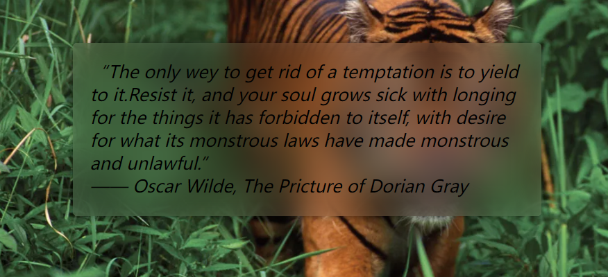

<style>
  .example {
    margin-bottom: 20px;
  }
  .box {
    width: 200px;
    height: 100px;
    background: yellow;
    position: relative;
  }
  .box-shadow1 {
    box-shadow: 0 5px 4px -4px black;
  }
  .box-shadow2 {
    box-shadow: 5px 5px 10px -5px black;
  }
  .box-shadow3 {
    box-shadow: 5px 0 4px -4px black,
                -5px 0 4px -4px black;
  }
  .box-special::after {
    content: '';
    position: absolute;
    left: 100%;
    top: 50%;
    transform: translateY(-50%);
    border-left: 10px solid yellow;
    border-top: 10px solid transparent;
    border-right: 10px solid transparent;
    border-bottom: 10px solid transparent;
  }
  .box-shadow4 {
    box-shadow: 2px 2px 5px rgba(0,0,0,.5)
  }
  .box-shadow5 {
    filter: drop-shadow(2px 2px 5px rgba(0,0,0,.5))
  }
  .text-box {
    background: transparent;
    border: 5px solid pink;
    font-size: 24px;
    font-weight: 800;
    text-align: center;
    text-shadow: 0 5px 2px yellow;
    filter: drop-shadow(2px 2px 5px rgba(0,0,0,.5))
  }
  .box.img-box {
    background: url("https://cdn.britannica.com/52/146352-050-B4908468/Sumatran-tiger.jpg");
    background-size: 100%;
    filter: sepia(1) saturate(4) hue-rotate(295deg);
    transition: .5s filter;
  }
  .img-box:hover {
    filter: none;
  }
  .box.img-box2 {
    background-color: hsl(335, 100%, 50%);
    transition: .5s background-color;
  }
  .box.img-box2 img{
    width: 100%;
    height: 100%;
    mix-blend-mode: luminosity;
  }
  .box.img-box3 {
    background-image: url("https://cdn.britannica.com/52/146352-050-B4908468/Sumatran-tiger.jpg");
    background-size: 100%;
    background-color: hsl(335, 100%, 50%);
    background-blend-mode: luminosity;
    transition: .5s background-color;
  }
  .box.img-box3:hover,.box.img-box2:hover {
    background-color: transparent;
  }
</style>
## 单侧投影
> box-shadow: x方向偏移 y方向偏移 模糊半径 扩张半径 颜色 内投影/外投影
### 单侧投影
<div class="example box box-shadow1"></div>

```css
box-shadow: 0 5px 4px -4px black; // 扩张半径=-模糊半径
```

### 邻边投影
<div class="example box box-shadow2"></div>

```css
box-shadow: 5px 5px 10px -5px black; // 扩张半径=-模糊半径/2
```

### 双侧投影
使用两侧单侧投影
<div class="example box box-shadow3"></div>

```css
box-shadow: 5px 0 4px -4px black,
            -5px 0 4px -4px black;
```

## 不规则投影
### 使用box-shadow:
<div class="example box box-special box-shadow4"></div>

### 使用svg滤镜（浏览器不完成支持）
常见的滤镜效果如下：blur() grayscale() drop-shadow(); 使用drop-shadow即可实现不规则投影：
<div class="example box box-special box-shadow5"></div>

```css
filter: drop-shadow(2px 2px 5px rgba(0,0,0,.5))
```

**注意**：任何非透明的部分都会被一视同仁地打上阴影。如果使用text-shadow给文本加上了阴影，使用drop-shadow会给文本阴影打上阴影。

<div class="example box text-box box-shadow6">
nothing is impossible...
</div>

## 染色效果
### 基于滤镜的染色效果
<div class="example box img-box"></div>

```css
filter: sepia(1) saturate(4) hue-rotate(295deg);
```

滤镜sepia(), 它会给图片增加一种降饱和度的橙黄色染色效果,几乎所有像素的色相值会被收敛到35~40。
滤镜saturate()，用来改变饱和度。
滤镜hue-rotate()，用来把每个像素的色相以指定的度数进行偏移。

### 基于混合模式的方案
方案一：div+img
<div class="example box img-box2">
  
</div>

```css
div {
  background-color: hsl(335, 100%, 50%);
  transition: .5s background-color;
}

div > img {
  mix-blend-mode: luminosity;
}

div:hover {
  background: transparent;
}
```

方案二：单个div设置background
<div class="example box img-box3"></div>

```css
div {
  background-image: url("xxx");
  background-color: hsl(335, 100%, 50%);
  background-blend-mode: luminosity;
  transition: .5s background-color;
}
```
```css
div:hover {
  background-color: transparent;
}
```

可以看到方案一中hover时无法切回到单色模式，方案二是完全可以的。

## 毛玻璃效果


实现方法：利用伪元素，将文字底部区域的图片进行模糊(blur) :

```html
<main>
  <blockquote>
    “The only wey to get rid of a temptation is to yield to it.Resist it, and your soul grows sick with longing for the things it has forbidden to itself, with desire for what its monstrous laws have made monstrous and unlawful.”
    <footer> ——
      <cite>
        Oscar Wilde, The Pricture of Dorian Gray
      </cite>
    </footer>
  </blockquote>
</main>
```
```css
body, main::before {
  background: url("xxx.jpg") 0 / cover fixed;
}
main {
  position: relative;
  overflow: hidden;
  background: hsla(0,0%,100%,.3);
}
main::before {
  content: '';
  position: absolute;
  left:0;top:0;right:0;right:0;
  z-index: -1;
  background: url("xxx.jpg") 0 / cover fixed;
  filter: blur(20px);
  margin: -30px;
}
```

## 折角效果
<style>
  .angle-45 {
    background-image: linear-gradient(45deg, rgba(0,0,0,.5) 50%, white 0);
    background-size: 30px 30px;
    background-repeat: no-repeat;
    background-position: top right;
    border-radius: 7px;
  }
  .angle-30 {
    background-image: linear-gradient(30deg, rgba(0,0,0,.5) 50%, white 0);
    background-size:34px 20px;
    background-repeat: no-repeat;
    background-position: top right;
  }
  .angle-30-perf {
    background-image: linear-gradient(30deg, transparent 50%, white 0);
    background-size:34px 20px;
    background-repeat: no-repeat;
    background-position: top right;
    border-radius: 7px;
    position: relative;
  }
  .angle-30-perf::before {
    content: '';
    position: absolute;
    right: 0;
    top: 0;
    background: linear-gradient(60deg, rgba(0,0,0,.5) 50%, transparent 0);
    width: 20px;
    height: 34px;
    transform-origin: right bottom;
    transform: translateY(-14px) rotate(-30deg);
    border-bottom-left-radius: inherit;
    box-shadow: -.2em .2em .3em -.1em rgba(0,0,0,.15);
  }
</style>

### 45度角
最简单的一种实现，利用渐变, 但是明显可以看出画出的图形不太逼真，因为无法在折角部分增加border-radius和box-shadow的处理（解决方法见之后的”其他角度“）：

<div class="example box angle-45"></div>

```css
.angle-45 {
  background-image: linear-gradient(45deg, rgba(0,0,0,.5) 50%, white 0);
  background-size: 30px 30px;
  background-repeat: no-repeat;
  background-position: top right;
}
```

### 其他角度
直接用45度角通用的处理方法实现的效果：

<div class="example box angle-30"></div>

可以看出，直接用45度角的方法不行，因为x轴和y轴现在长度不相同，反转之后的效果明显不对。

因此需要借助伪元素，借助伪元素之后明显逼真了很多，所有角度的折角都可以通过这种方式实现：
<div class="example box angle-30-perf"></div>

```css
.angle-30-perf {
  background-image: linear-gradient(30deg, transparent 50%, white 0);
  background-size: 34px 20px;
  background-repeat: no-repeat;
  background-position: top right;
  border-radius: 7px;
  position: relative;
}
.angle-30-perf::before {
  content: '';
  position: absolute;
  right: 0;
  top: 0;
  background: linear-gradient(60deg, rgba(0,0,0,.5) 50%, transparent 0);
  width: 20px;
  height: 34px;
  transform-origin: right bottom;
  transform: translateY(-14px) rotate(-30deg);
  border-bottom-left-radius: inherit;
  box-shadow: -.2em .2em .3em -.1em rgba(0,0,0,.15);
}
```