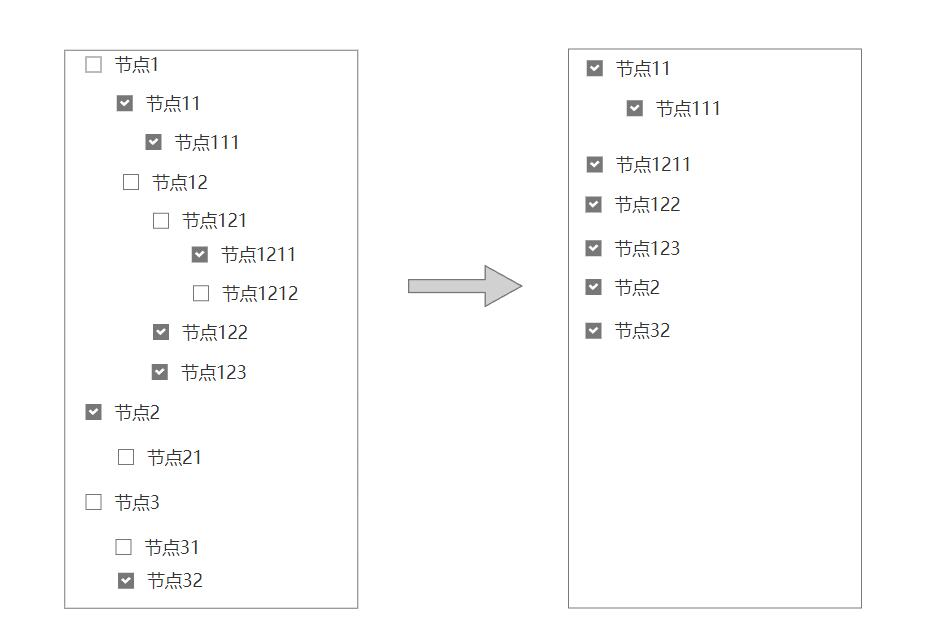
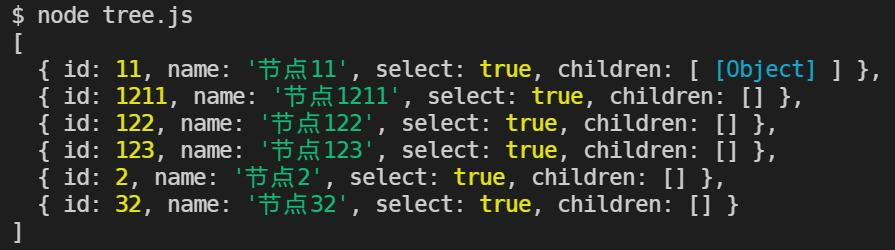

## 背景
工作上遇到的这个问题，主要需求是根据选中状态过森林。对于森林中的每棵树，如果节点选中，则保留，如果该节点的父节点未被选中，则需向上提升，得到最简的一棵树。举例如下：



## 分析

```yml
  对于森林中的每棵树：
    对于树中的每一个节点：
      如果节点被选中：
        保存节点，
        重复过滤节点的孩子
      否则：
        保存过滤过的节点的孩子
```

## 实现
```js
function filterForest(arr) {
  let res = [];
  arr.forEach((item)=>{
    if(item.select){
      item.children = filterForest(item.children);
      res.push(item);
    } else {
      res = res.concat(filterForest(item.children));
    }
  })
  return res;
}
```

## 测试
以上面的那个森林为例，转换为json格式：
```json
const forest = [
  {
    id: 1,
    name: '节点1',
    select: false,
    children: [
      {
        id: 11,
        name:'节点11',
        select: true,
        children: [
          {
            id: 111,
            name: '节点111',
            select: true,
            children: []
          }
        ]
      },
      {
        id: 12,
        name: '节点12',
        select: false,
        children: [
          {
            id: 121,
            name: '节点121',
            select: false,
            children: [
              {
                id: 1211,
                name: '节点1211',
                select: true,
                children: []
              },
              {
                id: 1212,
                name: '节点1212',
                select: false,
                children: []
              }
            ]
          },
          {
            id: 122,
            name: '节点122',
            select: true,
            children: []
          },
          {
            id: 123,
            name: '节点123',
            select: true,
            children: []
          }
        ]
      }
    ]
  },
  {
    id: 2,
    name: '节点2',
    select: true,
    children: [
      {
        id: 21,
        name: '节点21',
        select: false,
        children: []
      }
    ]
  },
  {
    id: 3,
    name: '节点3',
    select: false,
    children: [
      {
        id: 31,
        name: '节点31',
        select: false,
        children: []
      },
      {
        id: 32,
        name: '节点32',
        select: true,
        children: []
      }
    ]
  }
]
```

调用函数后打印结果：
```js
console.log(filterForest(forest));
```

结果：
